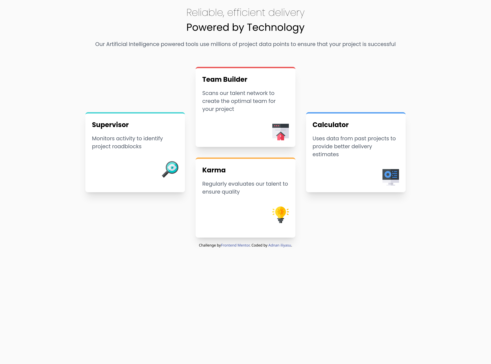

# Frontend Mentor - Four card feature section solution

This is a solution to the [Four card feature section challenge on Frontend Mentor](https://www.frontendmentor.io/challenges/four-card-feature-section-weK1eFYK). Frontend Mentor challenges help you improve your coding skills by building realistic projects. 

## Table of contents

- [Overview](#overview)
  - [The challenge](#the-challenge)
  - [Screenshot](#screenshot)
  - [Links](#links)
- [My process](#my-process)
  - [Built with](#built-with)
- [Author](#author)

## Overview

### The challenge

Users should be able to:

- View the optimal layout for the site depending on their device's screen size

### Screenshot

### Links

- Solution URL: [Solution](https://github.com/Adnan0-IM/four-card-feature)
- Live Site URL: [Live Site](https://resonant-alfajores-3eeba7.netlify.app)

## My process

### Built with
- Flexbox
- CSS Grid
- Tailwind CSS - CSS Framework
- Mobile-first workflow
- [React](https://reactjs.org/) - JS library

## Author

- Frontend Mentor - [@Adnan0-IM](https://www.frontendmentor.io/profile/Adnan0-IM)
- Twitter - [@Adnan_imd](https://www.twitter.com/Adnan_imd)
